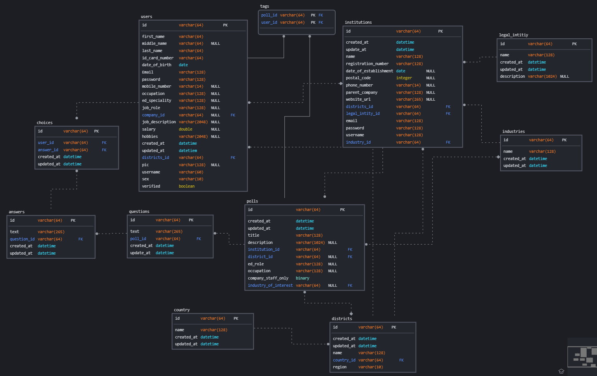

<h1 align='center'><a href='https://kura-mxoi.onrender.com/'>KURA</a></h1>

<h4 align="center">Choices with <i><b style="color: rgb(59 130 246)">IMPACT!</b></i></h4>
<div align="center">
<br />

[](https://github.com/ibrahimmorad)
[](https://github.com/EladlyDev)
[](https://github.com/duncmv)

[](LICENSE)
[
](https://github.com/duncmv/Kura/releases/)

[](https://github.com/duncmv/Kura/network/members)
[](https://github.com/duncmv/Kura/stargazers)


</div>

## [Description](#table-of-contents)

[KURA](https://kura-mxoi.onrender.com/) is a polling service that helps the institutions and companies to include their employees or others in their decision-making process.

An institution-type user can create polls and get statistical information about votes on their own polls.

A normal user can vote on polls and get some information (what the institution allows) about polls he/she votes on.

## Table of Contents
- [KURA](#)
			- [Choices with *IMPACT!*](#choices-with-impact)
	- [Description](#description)
	- [Table of Contents](#table-of-contents)
	- [Technologies](#technologies)
	- [Installation](#installation)
	- [Usage](#usage)
    	- [go to home page](#go-to-home-page)
    	- [Register](#register)
    	- [choose account type](#choose-account-type)
    	- [institution](#an-institution-user)
    	- [individual](#an-individual-user)
	- [Contributing](#contributing)
	- [License](#license)


## [Technologies](#table-of-contents)
[](https://www.python.org/)
[](https://www.sqlalchemy.org/)
[](https://www.postgresql.org/)
[](https://flask.palletsprojects.com/)
[](https://reactjs.org/)
[](https://nextjs.org/)

### Database
Implemented by [Ibrahim Morad](https://github.com/IbrahimMurad/)
- We used postgresql as the database management system to store our data.
- We used sqlalchemy as the ORM service that connects our engine to the database server and query the required data.
- database schema is shown in the following data model. 
> This data model is made by [sqldbm](http://sqldbm.com/Home/) ([kura-model](https://app.sqldbm.com/MySQL/DatabaseExplorer/p295076#)).


And it consists of the following tables:
  1. [answers](models/answers.py)
  2. [choices](models/choices.py)
  3. [countries](models/countries.py)
  4. [districts](models/districts.py)
  5. [industries](models/industries.py)
  6. [institutions](models/institutions.py)
  7. [legal_entities](models/legal_entity.py)
  8. [polls](models/polls.py)
  9. [questions](models/questions.py)
  10. [tags](models/tags.py)
  11. [users](models/users.py)

- There is [basemodel](models/base_model.py) class that defines the id, created_at and updated_at columns for all the tables (except tags)
- The other part of the database is the methods implemented so that the api can use the database without getting involved with the database or the ORM service. These methods are:

| the method                            | syntax                             | example                                                         | description                                                              |
| ------------------------------------- | ---------------------------------- | --------------------------------------------------------------- | ------------------------------------------------------------------------ |
| [get](models/engine/storage.py#97)    | ``get(class_name, id)``            | `` Storage.get(User, '6666a7d8-7d69-4c7f-a341-14997c8306c0') `` | returns the user with the given id                                       |
| [all](models/engine/storage.py#21)    | ``all(class_name)`` <br> ``all()`` | `` Storage.all(User) `` <br> ``Storage.all()``                  | returns all the users <br> returns all the records in the whole database |
| [count](models/engine/storage.py#101) | ``count(class_name)``              | `` Storage.count(User) ``                                       | returns the number of records in a certain table                         |
| [new](models/engine/storage.py#56)    | `` new(object) ``                  | `` Storage.new(user1) ``                                        | adds a new record                                                        |
| [delete](models/engine/storage.py#66) | `` delete(object) ``               | `` Storage.delete(user1) ``                                     | deletes a record                                                         |
| [save](models/engine/storage.py#61)   | `` save() ``                       | `` Storage.save() ``                                            | commit changes                                                           |

### API
Implemented by [Duncan](https://github.com/duncmv/)
- To DO .....


### Frontend
Implemented by [Mohamed Eladly](https://github.com/EladlyDev)
- To DO .....


## [Installation](#table-of-contents)

1. **Setup dependencies**: run the bash script `setup.sh`, it should install all the required technologies required for the project.
```bash
chmod u+x setup.sh; ./setup.sh
```
2. **setup the database** :
	- run postgresql in interactive mode.
	```bash
	psql -u postgres postgres
	```
	- Create the database, the user and give the user privilages for the project.
	```sql
	CREATE DATABASE kura_db;
	CREATE ROLE kura_user WITH LOGIN PASSWORD 'test_choices_01';
	GRANT ALL ON DATABASE kura_db TO kura_user;
	\q
	```
	- got to frontend directory.
	```bash
	cd frontend
	```
	- start the application.
	```bash
	npm run dev
	```

## [Usage](#table-of-contents)

#### Go to home page
A user can go to the home page, which works as the landing page too, using the following url: [https://kura-mxoi.onrender.com/](https://kura-mxoi.onrender.com/).

#### Register
From there, a user can click join or sign up to register or sign in to (you know).

For a first visit, of course, a user needs to register, so click on join.

This redirects the user to the [registration page](https://kura-mxoi.onrender.com/register).

#### Choose account type
There are two types of accounts, [institution](#an-institution-user) and [individual](#an-individual-user).
Follow the registration steps by filling the required fields and submit. This redirects you to your home page.
There you can create polls if you are an [institution](#an-institution-user) or vote on polls if you are an [individual](#an-individual-user).

### An institution user
- 

### An individual user
- 

## [Contributing](#table-of-contents)
1. Fork the project.
2. Clone the repository.
3. Make the changes you see.
4. commit the changes you made.
5. Make a pull request and wait for you request to be accepted or commented on.

## [License](#table-of-contents)
This project is licensed under the MIT license. Feel free to edit and distribute this template as you like.

See [LICENSE](LICENSE) for more information.
